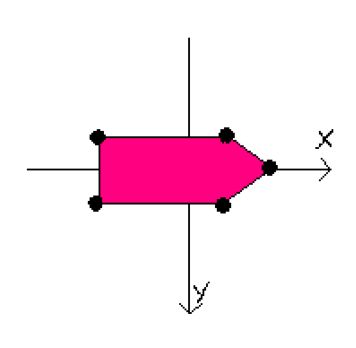

# Vessel Configuration Files

Vessel configrations are described in a custom JSON format, which has to be used in order to specify new vessels for the simulation.
See an example of a differential drive USV in the `diff_drive_simple.json` file.

<!-- vscode-markdown-toc -->
* 1. [Format description](#Formatdescription)
	* 1.1. [`metadata`](#metadata)
	* 1.2. [`actuators`](#actuators)
		* 1.2.1. [`Propeller`](#Propeller)
	* 1.3. [`points_of_mass`](#points_of_mass)
	* 1.4. [`hull_shape`](#hull_shape)

<!-- vscode-markdown-toc-config
	numbering=true
	autoSave=true
	/vscode-markdown-toc-config -->
<!-- /vscode-markdown-toc -->

##  1. Format description

The format consists of four objects: `metadata`, `actuators`, `points_of_mass`, and `hull_shape`.

All positions will be recomputed relative to the centre of mass when processed by the simulation, so all positions described here just have to have the correct position relative to each other.
Positions towards positive x are towards the bow, and positive along y are the starboard side, see image below.

###  1.1. `metadata`

Contains four fields that describe useful information about the specific configuration.

| Name          | Description                   | Type      |     
| ---           | ---                           | ---       |
| `name`        | Short descriptive name        | `string`  |
| `description` | Longer description of vessel  | `string`  |
| `author`      | Name of the author            | `string`  |
| `email`       | Email of the author           | `string`  |

###  1.2. `actuators`

An array of different actuators and their parameters.
An actuator is defined by a class that inherits form the `Actuator` class, and has to be implemented prior to use. Currently, only a `Propeller` class has been implemented.

Comomn properties all actuators should have are:
| Name          | Description                   | Type      |     
| ---           | ---                           | ---       |
| `name`        | Actuator name                 | `string`  |
| `type`        | Name of actuator class in snake_case  | `string`  |
| `servo_channel`| Channel number for control outputs from a controller | `int`  |
| `position`    | Position of actuator (`x`, `y`, `z`)  | `array<float>`  |
| `attitude`    | Attitude of actuator (`pitch`, `yaw`) | `array<float>`  |

>`pitch` in `attitude` should always be zero for this simulation, as it is in 2D.

> An actuators zero attitude is the force vector of the actuator pointing forwards (along positive x-axis).

####  1.2.1. `Propeller`

Unique properties for the propeller are:
| Name          | Description               | Type      |     
| ---           | ---                       | ---       |
| `ang_vel_min` | Minimum angular velocity  | `float`   |
| `ang_vel_max` | Maximum angular velocity  | `float`   |
| `k_t`         | Motor torque coefficient  | `float`   |

###  1.3. `points_of_mass`

An array of objects that contain (x,y,z)-coordinates and a mass of points. These points define the inertia and how forces from actuators affects the vessel.

###  1.4. `hull_shape`

An array of objects that contain (x,y,z)-coordinates of points.
These points defines the polygon that is a simplification of a hull shape in the waterline. This shape influences how drag forces affect the vessel.

The points should be defined in a clockwise order.

> This functionality is not yet implemented.
